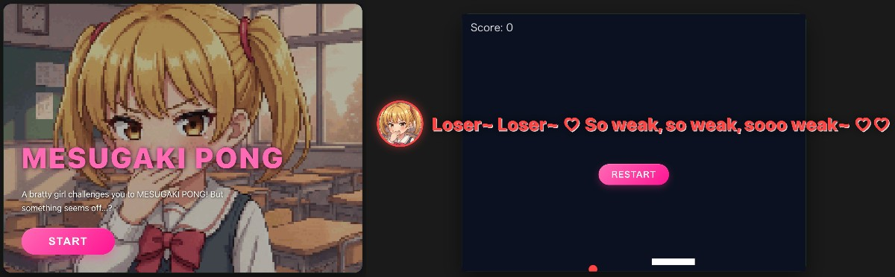
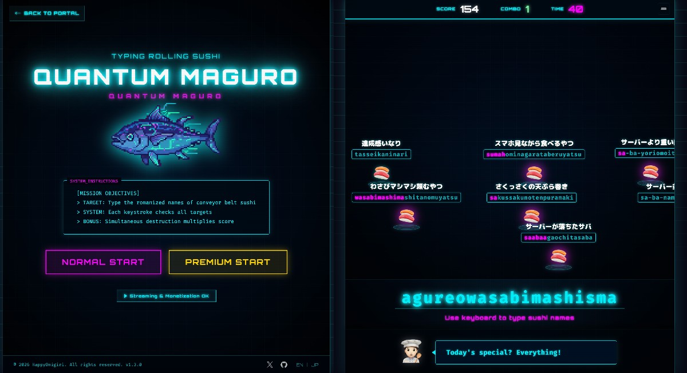

# 🍙 ONIGIRI GAME PORTAL

[](https://opensource.org/licenses/MIT)

_Read this in [Japanese](README.md)._

Fun games you can play in your browser!

---

## 🚀 Play Now

[https://onigiri-game-portal.vercel.app/](https://onigiri-game-portal.vercel.app/)

---

## Included Games

### 1. MESUGAKI PONG

**A chaotic ping pong game where a cheeky brat taunts you.**



### 2. Quantum Maguro

**An exhilarating typing game themed after conveyor belt sushi! Aim for high scores by typing the sushi names in Romaji.**



## Tech Stack

- **Build tool**: Vite
- **Languages**: TypeScript, HTML
- **Styling**: Vanilla CSS
- **Deployment**: Vercel

---

## Getting Started

Steps to run the project locally:

```bash
# Clone the repository
git clone git@github.com:HappyOnigiri/game-portal

# Navigate to the project directory
cd game-portal

# Install dependencies
npm install

# Start the development server
npm run dev
```

---

## Streaming & Video Content

**Streaming, video content, and monetization are 100% permitted!**

We welcome all streamers and VTubers to play our games. No prior permission is required.

Please check the following for streaming guidelines and assets:

**[Streaming Guidelines](https://onigiri-game-portal.vercel.app/guidelines.html)**

---

## License

This entire repository (including source code and all assets like images and audio) is released under the **MIT License**.
