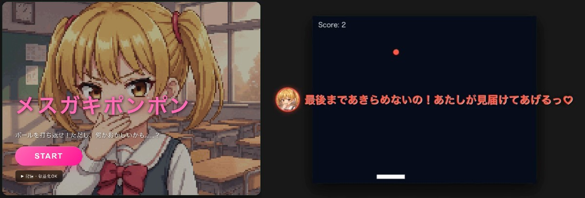
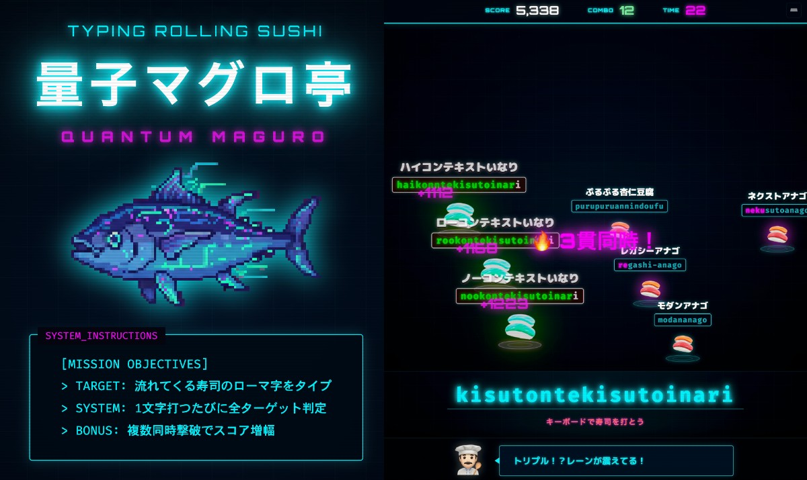

# 🍙 ONIGIRI GAME PORTAL

[](https://opensource.org/licenses/MIT)

_Read this in [English](README.en.md)._

ブラウザで遊べる楽しいゲームです！

---

## 🚀 今すぐプレイ

[https://onigiri-game-portal.vercel.app/](https://onigiri-game-portal.vercel.app/)

---

## 収録ゲーム

### 1. メスガキポンポン (Mesugaki Pong)

**メスガキに煽られながらやるカオスなピンポンゲーム。**



### 2. 量子マグロ亭 (Quantum Maguro)

**回転寿司がテーマの爽快タイピングゲーム！流れてくる寿司ネタをローマ字入力して高得点を目指そう。**



## Tech Stack

- **ビルドツール**: Vite
- **言語**: TypeScript, HTML
- **スタイリング**: Vanilla CSS
- **デプロイ**: Vercel

---

## ローカル環境での起動手順

ローカル環境でプロジェクトを起動する手順：

```bash
# リポジトリをクローン
git clone git@github.com:HappyOnigiri/game-portal

# プロジェクトディレクトリへ移動
cd game-portal

# 依存関係をインストール
npm install

# 開発サーバーを起動
npm run dev
```

---

## 実況・動画配信について

**実況・動画配信・収益化は完全に許可されています！**

すべての配信者やVTuberの皆様のプレイを歓迎します。事前の許可は必要ありません。

配信用のガイドラインや素材のご確認は以下からお願いします：

**[配信ガイドライン](https://onigiri-game-portal.vercel.app/guidelines.html)**

---

## ライセンス

このリポジトリ全体（ソースコードおよび画像・音声などのすべてのアセット素材）は **MIT License** で公開されています。
